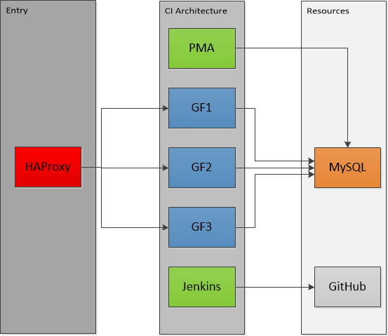
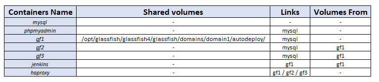
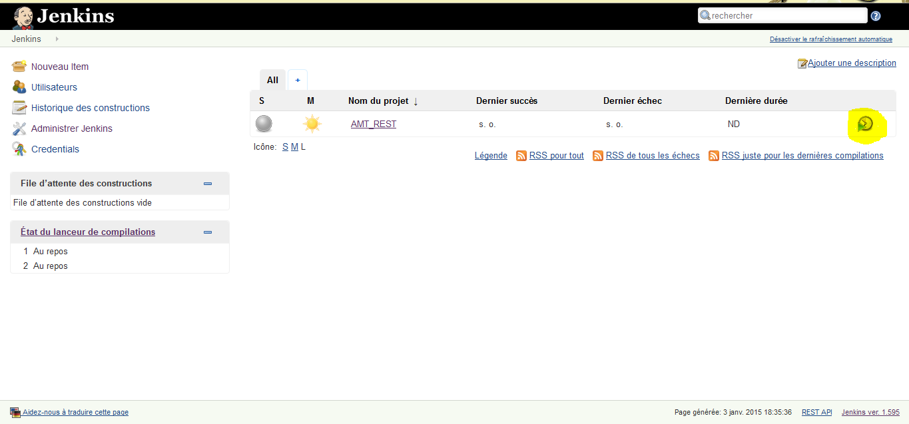
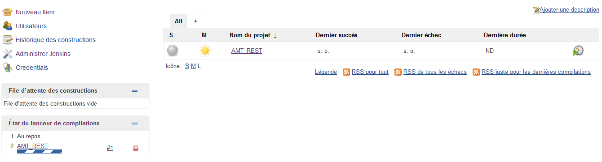
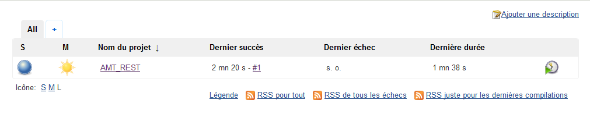
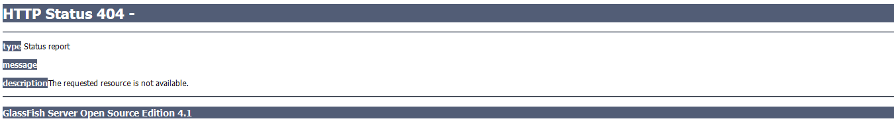
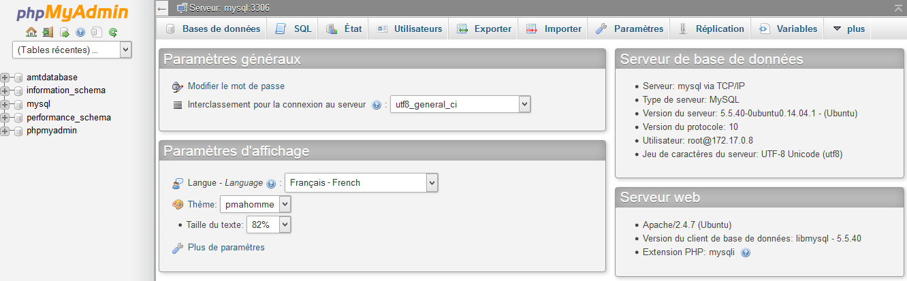
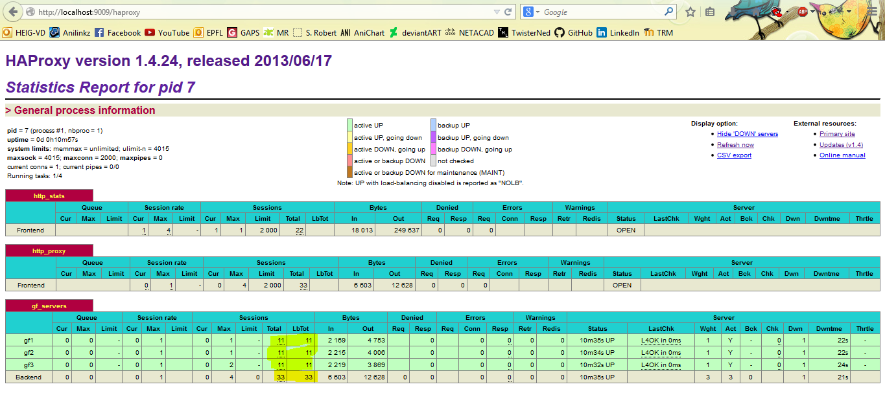
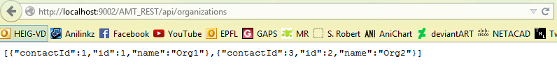

AMT_Vagrecker
=============
## B. Carvalho Bruno & Bignens Julien  ##

This is the repo for the project number 2 of AMT, 2014-2015. You will find here everything you need to get started with our implementation. You will find at the end of this document some advices and troubleshooting, should you encounter any problems.

## Important notice ##

We assume here that the user ***knows*** about [Vagrant](https://www.vagrantup.com/) and [Docker](https://www.docker.com/) and has [VirtualBox](https://www.virtualbox.org/) installed (provisionner for Vagrant). Vagrant must also be installed. As for Docker it is not necessary, it will be automatically installed in the VM used by Vagrant.

# Quick Overview #

Let's see how the architecture is built and how it works.

The client can access the web application by accessing the HAProxy container, which is a load balancer proxy server. This server will "serve" one of the three availables GlassFish web applications that are running simultaneously.

Meanwhile, a developper can access Jenkins and PHPMyAdmin, to be able to work on the CI (Continuous Integration) of the project. The Glassfish instances and the PHPMyAdmin (PMA) containers also interract wtih MySQL, which is a MySQL server. Since there is only one Database, any GF server can access the same data, which is **normal**. Jenkins can communicate with GitHub, to be able to pull the most recent source code and deploy it automatically on Glassfish.

This is the basic implementation, let's see precisely how it works now.

# From a Maven project to a web application #

Let's try to decorticate the [MO](http://en.wikipedia.org/wiki/Modus_operandi) of the our implementation. So first, what do we have ?

- The source code of the [first project](https://github.com/bbcnt/AMT_REST) 
- And that's all really...

We have a maven project and we want to deploy it on a glassfish instance. The idea here is :

1. Generate a .war file from the Maven project with Jenkins (the Maven project is pulled from GitHub)
2. Deploy this project on a glassfish instance
3. Link everything so the glassfish server can work with the MySQL database.
4. Add a few tools, like PHPMyAdmin, to be able to work efficiently with MySQL.
5. Add a few other instances of Glassfish (replicates of the first one).
6. Put in some load balancing and we are done.

So we do have a few steps ahead of us...

First, we are going to talk about the linked containers and shared volumes.

# Shared volumes and links #

For containers to be able to "talk to each other", we need to create *links* between them. Also, to be able to share data, we need to create volumes. There are two kinds of shared volumes, we can either create a container that will only serve as a data container, or we can directly share a directory from an existing container. In this lab, we only use the second option, since we pretty much do everything with scripts and ADD (using Dockerfiles) the files we need. 

So, this is the shared volumes structure of our architecture:

Basically, pretty much all containers are linked to the mysql one, and we have a share in the server gf1 (we shall explain why later). Also, for haproxy to be able to work with the glassfish servers, it needs to be linked to them. Jenkins only works with gf1, again, this is used with the shared volume, we'll talk about this later.

In the Vagrantfile, we can see these operations here, for example: 

	d.run "phpmyadmin", image: "heig/phpmyadmin", args: "-p 5050:80 --link mysql:mysql"
	OR
	d.run "gf1", image: "heig/glassfish", args: "-p 4081:4848 -p 4082:8080 --link mysql:mysql -v /opt/glassfish/glassfish4/glassfish/domains/domain1/autodeploy/"

As a reminder of what we have seen during the presentation on docker, using link will associate the IP of the linked container and its name in the hosts file (/etc/hosts) of a container. Example, here is the hosts file of the haproxy container:

	172.17.0.8      f41ad35be329
	127.0.0.1       localhost
	::1     localhost ip6-localhost ip6-loopback
	fe00::0 ip6-localnet
	ff00::0 ip6-mcastprefix
	ff02::1 ip6-allnodes
	ff02::2 ip6-allrouters
	172.17.0.5      gf2
	172.17.0.6      gf3
	172.17.0.4      gf1

We can see the GF containers are there.

As promised, we will now see why we share the autodeploy directory of gf1.

## Some (dirty) magic ##

Since we have every glassfish instances that come from the same image, they all are the same. Also, there is a pretty cool feature in GF. If you put a .war file inside the autodeploy directory of your domain (here it's the default domain1), it will be automatically deployed on Glassfish (no need to use asadmin or else). So, why is this cool? 

Well, simple, since every glassfish instance is the same, they have the same structure, and of course, the autodeploy directory is in the same place for each of them. So, let's say we only place the .war file in gf1's autodeploy dir, and all the other gf instances map their own autodeploy dir with this one, putting the file on gf1 will put it on all the gf instances. So it's really easy to make this from Jenkins to gf1 (this is why Jenkins is only linked with gf1).

We create the .war file, place it on the autodeploy dir of gf1 (using the shared volume), all the other gf instances synchronize their content with gf1, so they all get the .war file and deploy it automatically. If this is not magical, I don't know what is.

So instead of having some complicated script in the post-treatment of Jenkins, we only have 

	cp $JENKINS_HOME/jobs/AMT_REST/workspace/target/AMT_REST-1.0-SNAPSHOT.war /opt/glassfish/glassfish4/glassfish/domains/domain1/autodeploy/AMT_REST.war

A stupid cp command that will take the created war, rename it in a more friendly name, copy it inside the shared volume (note that you access shared volumes by the same path, so it's /opt/glassfish/glassfish4... which is the path on the gf1 instance). And after that, the deployment is done. A flag file can be found when the autodeploy has succeeded.

# Running the test implementation #

Ok, so we have seen how the architecture works somehow (we'll discuss each container later) and we now know what it does. So let's now see how to use it.

First of all, everything has been automated, so the only thing you'll have to do is... *press a button*. The automatisation works with our project 1, called AMT_REST. The documentation for the project itself is [here](https://github.com/bbcnt/AMT_REST). Now, let's do this.

### First point ###

Clone [this repo](https://github.com/bbcnt/AMT_Vagrecker). It contains all the Dockerfiles to create the architecture. 

### Second point ###

Get inside the clones repo and at the root (where the vagrantfile is), just type :

	vagrant up

Let is be known that the process is quite lenghty in time (one hour at least). The good point is, you don't have to do anything so you can enjoy a good coffee or else ;)

You may need to provision the VM (not needed on the first start), to do so :

	vagrant provision

Now sit back and relax...

### Third point ###

Now, the last point, the only thing you need to do is, get here :

	http://localhost:9001

This is the access to the jenkins application. Remember when we told you you would have to press a button? This is it.

If it'w working, the page will be displayed like this (with a progress bar on the left-down corner):

And if the sphere on the left becomes blue, it worked.

And... that's all. You can now access :

	http://localhost:9002/AMT_REST

And you have the deployed application (if you get an error 404, the deploy can take a few minutes, so be patient).

Once it's okay:

To generate test values:

	http://localhost:9002/AMT_REST/test

And this is it, it works! Remember to check [this repo](https://github.com/bbcnt/AMT_REST) for the documentation of the API itself.

We are done with the example, the next parts will be about the implementation.

# Port Mapping #

Before we get to the containers, let's see the port mapping between the Host, the vagrant VM and the Dockers. As described in the Vagrantfile :

    #These are the port forwarding that are configured
	config.vm.network "forwarded_port", guest: 7070, host: 9001 # Jenkins
	config.vm.network "forwarded_port", guest: 9090, host: 9002 # Reverse proxy (entrypoint for users)
	config.vm.network "forwarded_port", guest: 3306, host: 9003 # MySQL Server (pretty useless as is)
	config.vm.network "forwarded_port", guest: 5050, host: 9004 # PHPMyAdmin (use localhost:9004/phpmyadmin)
	config.vm.network "forwarded_port", guest: 4081, host: 9005 # GF1 config (4848)
    config.vm.network "forwarded_port", guest: 4082, host: 9006 # GF1 web (8080)
    config.vm.network "forwarded_port", guest: 4084, host: 9007 # GF2 web (8080)
    config.vm.network "forwarded_port", guest: 4086, host: 9008 # GF3 web (8080)
    config.vm.network "forwarded_port", guest: 4087, host: 9009 # HAProxy (stats on localhost:9009/haproxy login: admin, admin)

# Configuring MySQL #

We will start with the configuration of MySQL. Why? Because it's essential, is not dependant of any other docker and the others are dependant of this one. So, this seems reasonnable.

Let's take a look at the Dockerfile:

	FROM dockerfile/ubuntu

	RUN groupadd mysql
	RUN useradd mysql -g mysql -u 4242
	
	RUN apt-get update \
	 && apt-get install -y mysql-server \
	 && rm -rf /var/lib/mysql/mysql \
	 && rm -rf /var/lib/apt/lists/* # 20140918
	
	ADD start /start
	ADD example_config.sql /tmp/example_config.sql
	RUN chmod 755 /start
	
	EXPOSE 3306
	
	VOLUME ["/var/lib/mysql"]
	VOLUME ["/run/mysqld"]
	
	CMD ["/start"]
	
We simply install MySQL and add example_config.sql (this is a sql file that will be imported, as it is needed for PHPMyAdmin.

Then in the start.sh script, a few things of interest.

We create the users, for distant connexion.

	mysql -uroot -e "CREATE USER 'bruno'@'localhost' IDENTIFIED BY '123456';"
    mysql -uroot -e "CREATE USER 'bruno'@'%' IDENTIFIED BY '123456';"
	mysql -uroot -e "GRANT ALL PRIVILEGES ON * . * TO 'bruno'@'localhost';"
	mysql -uroot -e "GRANT ALL PRIVILEGES ON * . * TO 'root'@'%';"
	mysql -uroot -e "GRANT ALL PRIVILEGES ON * . * TO 'bruno'@'%'; 

We add the previous script 

	#Adding config file (some tables are needed for PHPMyAdmin)
    mysql -uroot < "/tmp/example_config.sql"

And that about sums it up. We now have a fully functionnal MySQL server.

# Configuring PHPMyAdmin #

Now, to work with MySQL, let's take a look at PHPMyAdmin. First, the Dockerfile:

	FROM dockerfile/ubuntu

	#Created by Brito Carvalho Bruno for AMT Project 2
	#Using tutum/phpmyadmin on github
	
	# Install base packages
	ENV DEBIAN_FRONTEND noninteractive
	RUN apt-get update && \
	    apt-get -yq install \
        curl \
		phpmyadmin \
        apache2 \
        libapache2-mod-php5 \
        php5-mysql \
        php5-gd \
        php5-curl \
        php-pear \
        php-apc && \
    rm -rf /var/lib/apt/lists/*
	RUN sed -i "s/variables_order.*/variables_order = \"EGPCS\"/g" /etc/php5/apache2/php.ini
	RUN curl -sS https://getcomposer.org/installer | php -- --install-dir=/usr/local/bin --filename=composer
	
	# Add image configuration and scripts
	ADD run.sh /run.sh
	RUN chmod 755 /*.sh
	
	# Configure /app folder with sample app
	RUN mkdir -p /app && rm -fr /var/www/html && ln -s /app /var/www/html
	ADD config.inc.php  /etc/phpmyadmin/config.inc.php
	RUN chmod 705 /etc/phpmyadmin/config.inc.php 
	
	# Add application code onbuild
	ONBUILD RUN rm -fr /app
	ONBUILD ADD . /app
	ONBUILD RUN chown www-data:www-data /app -R
	
	#symbolic link (for apache)
	RUN ln -s /usr/share/phpmyadmin/ /app
	
	EXPOSE 80
	WORKDIR /app
	CMD ["/run.sh"]

So, we install PHP, Apache and PHPMyAdmin, import some configuration file and that's it.

For the run.sh, its content is :

	#!/bin/bash
	source /etc/apache2/envvars
	exec apache2 -D FOREGROUND

So it's just to launch the apache service, since PHPMyAdmin is a web application.

The interesting part here is the config.inc.php file, specifically, this part:
	
	/*
	 * First server
	 */
	$i++;
	/* Authentication type */
	$cfg['Servers'][$i]['auth_type'] = 'cookie';
	/* Server parameters */
	$cfg['Servers'][$i]['host'] = 'mysql';
	$cfg['Servers'][$i]['connect_type'] = 'tcp';
	$cfg['Servers'][$i]['port'] = '3306';
	$cfg['Servers'][$i]['compress'] = false;
	/* Select mysql if your server does not have mysqli */
	$cfg['Servers'][$i]['extension'] = 'mysqli';
	$cfg['Servers'][$i]['AllowNoPassword'] = false;

We are giving the information about the MySQl server. 

And in this part :

	/* User used to manipulate with storage */
 	$cfg['Servers'][$i]['controlhost'] = '';
 	$cfg['Servers'][$i]['controluser'] = 'root';
 	$cfg['Servers'][$i]['controlpass'] = '123456';

The info about the controluser, if we don't provide this info, PHPMyAdmin will give us warnings. 

And that's pretty much all. The database used in the project is called "amtdatabase" and if you need to access this container:

	http:localhost:9004/phpmyadmin

Then login as :

	login : root
	Password : 123456

# Configuring Glassfish #

Before configuring Jenkins, let's see how it's done on Glassfish. Once again, note that all three instances come from the same image so the configuration is ***the same***. It's only in the run method of docker that we share gf1's autodeploy directory, nothing else.

As always, let's check the Dockerfile first:

	FROM oraclelinux:7.0
	# Environment variables required for this build (do NOT change)
	# -------------------------------------------------------------
	ENV JAVA_RPM jdk-8u25-linux-x64.rpm
	ENV GLASSFISH_PKG http://dlc-cdn.sun.com/glassfish/4.1/release/glassfish-4.1.zip
	ENV PKG_FILE_NAME glassfish-4.1.zip
	
	ENV DOMAIN_NAME domainAMTREST
	ENV DB_NAME amtdatabase
	ENV DB_TECHNICAL_USER root
	ENV DB_TECHNICAL_USER_PASSWORD 123456
	
	ENV JDBC_JNDI_NAME JNDI/domainAMTREST
	ENV JDBC_CONNECTION_POOL_NAME domainAMTREST_POOL
	
	# Install and configure Oracle JDK 8u25
	# -------------------------------------
	ADD $JAVA_RPM /root/
	RUN rpm -i /root/$JAVA_RPM && rm /root/$JAVA_RPM
	ENV JAVA_HOME /usr/java/default
	ENV CONFIG_JVM_ARGS -Djava.security.egd=file:/dev/./urandom
	# Setup required packages (unzip), filesystem, and oracle user
	# ------------------------------------------------------------
	# Enable this if behind proxy
	# RUN sed -i -e '/^\[main\]/aproxy=http://proxy.com:80' /etc/yum.conf
	RUN yum install -y unzip && yum clean all
	RUN useradd -b /opt -m -s /bin/bash glassfish && echo glassfish:glassfish | chpasswd
	RUN cd /opt/glassfish && curl -O $GLASSFISH_PKG && unzip $PKG_FILE_NAME && rm $PKG_FILE_NAME
	RUN chown -R glassfish:glassfish /opt/glassfish*
	
	ADD mysql-connector-java-5.1.33-bin.jar /mysql-connector-java-5.1.33-bin.jar
	
	# Default glassfish ports
	EXPOSE 4848 8080 8181
	# Set glassfish user in its home/bin by default
	USER glassfish
	WORKDIR /opt/glassfish/glassfish4/bin
	# User: admin / Pass: glassfish
	RUN echo "admin;{SSHA256}80e0NeB6XBWXsIPa7pT54D9JZ5DR5hGQV1kN1OAsgJePNXY6Pl0EIw==;asadmin" > /opt/glassfish/glassfish4/glassfish/domains/domain1/config/admin-keyfile
	RUN echo "AS_ADMIN_PASSWORD=glassfish" > pwdfile
	# Default to admin/glassfish as user/pass
	
	RUN \
	./asadmin start-domain && \
	./asadmin --user admin --passwordfile pwdfile enable-secure-admin && \
	./asadmin --user admin --passwordfile pwdfile create-jdbc-connection-pool --restype=javax.sql.XADataSource --datasourceclassname=com.mysql.jdbc.jdbc2.optional.MysqlXADataSource --property user=$DB_TECHNICAL_USER:password=$DB_TECHNICAL_USER_PASSWORD:serverName=mysql:portNumber=3306:databaseName=$DB_NAME $JDBC_CONNECTION_POOL_NAME && \
	./asadmin --user admin --passwordfile pwdfile create-jdbc-resource --connectionpoolid $JDBC_CONNECTION_POOL_NAME $JDBC_JNDI_NAME && \
	./asadmin stop-domain 
	
	RUN cp /mysql-connector-java-5.1.33-bin.jar /opt/glassfish/glassfish4/glassfish/domains/domain1/lib/mysql-connector-java-5.1.33-bin.jar
	
	RUN echo "export PATH=$PATH:/opt/glassfish/glassfish4/bin" >> /opt/glassfish/.bashrc
	# Default command to run on container boot
	CMD ["/opt/glassfish/glassfish4/bin/asadmin", "start-domain", "--verbose=true"]

So, 

1. We install Glassfish
2. We create the jdbc resource and pool linked to the MySQL container
3. We copy the mysql connector driver
4. And we start it.

Pretty easy thus far. And in reality, it is pretty easy all the way around. Need proof? There is nothing else to do! 

You can access the content (port 8080) with :

	http://localhost:9006 for gf1
	http://localhost:9007 for gf2
	http://localhost:9008 for gf3

And the config port (4848)
	
	http://localhost:9005 for gf1 
	#No need to access the other ones

# Configuring Jenkins #

This may be the biggest part in the whole thing. Configuring Jenkins was a little tricky at some point, even if in the end, the solution's pretty simple. It's just a question of what we backup and how we restore it.

For starters, let's check the Dockerfile:

	FROM dockerfile/ubuntu
	
	RUN apt-get update && apt-get install -y wget git curl zip && rm -rf /var/lib/apt/lists/*
	ENV JENKINS_VERSION 1.595
	
	#Setting Jenkins
	RUN mkdir /usr/share/jenkins/
	RUN useradd -d /home/jenkins -m -s /bin/bash jenkins
	ADD jenkins.war /usr/share/jenkins/jenkins.war
	ENV JENKINS_HOME /var/jenkins_home
	RUN usermod -m -d "$JENKINS_HOME" jenkins && chown -R jenkins "$JENKINS_HOME"
	VOLUME /var/jenkins_home
	
	#Installing Maven
	RUN apt-get install -y wget
	RUN wget --no-verbose -O /tmp/apache-maven-3.2.2.tar.gz http://archive.apache.org/dist/maven/maven-3/3.2.2/binaries/apache-maven-3.2.2-bin.tar.gz
	RUN echo "87e5cc81bc4ab9b83986b3e77e6b3095 /tmp/apache-maven-3.2.2.tar.gz" | md5sum -c
	
	# Install Java.
	RUN \
		echo oracle-java8-installer shared/accepted-oracle-license-v1-1 select true | debconf-set-selections && \
		add-apt-repository -y ppa:webupd8team/java && \
		apt-get update && \
		apt-get install -y oracle-java8-installer && \
		rm -rf /var/lib/apt/lists/* && \
		rm -rf /var/cache/oracle-jdk8-installer
	
	# install git
	RUN apt-get install -y git
	
	RUN tar xzf /tmp/apache-maven-3.2.2.tar.gz -C /opt/
	RUN ln -s /opt/apache-maven-3.2.2 /opt/maven
	RUN ln -s /opt/maven/bin/mvn /usr/local/bin
	RUN rm -f /tmp/apache-maven-3.2.2.tar.gz
	ENV MAVEN_HOME /opt/maven
	
	# remove download archive files
	RUN apt-get clean
	
	# Define commonly used JAVA_HOME variable
	ENV JAVA_HOME /usr/lib/jvm/java-8-oracle
	
	#Copying the job description and the plugins (mostly, for github)
	COPY AMT_REST $JENKINS_HOME/jobs/AMT_REST
	ADD plugins $JENKINS_HOME/plugins
	
	#Not used in the project but still useful
	ADD jenkins-cli.jar /jenkins-cli.jar
	
	#Adding the config for jenkins (maven and jdk location, credentials, etc)
	ADD configs/credentials.xml $JENKINS_HOME/credentials.xml
	ADD configs/config.xml $JENKINS_HOME/config.xml
	ADD configs/hudson.tasks.Maven.xml $JENKINS_HOME/hudson.tasks.Maven.xml
	
	# for main web interface:
	EXPOSE 8080
	# will be used by attached slave agents:
	EXPOSE 50000
	#USER jenkins
	
	ADD jenkins.sh /jenkins.sh
	RUN chmod 755 /jenkins.sh
	ENTRYPOINT ["/jenkins.sh"]

So, 

1. We install Java and Maven (to be able to create Maven projects)
2. We get Jenkins to work (install and setting environment)
3. We add the config files where we want and need them (we'll see those in a moment)
4. We also add the needed plugins (mostly for github support)
5. And that's all

So, what was tricky? Getting the plugins and the config to work. How did we solve that? By copying the plugins and configs of a working version (still, we needed to know which files to backup).

Jenkins configurations files are xml files. We won't discuss everything, but here are the things we wanted to recover:

- The job setup
- Locations of Maven and JDK
- Credentials for GitHub
- Plugins (not xml files but .jdi files)
- The post-compilation commands (remember, we copy the created .war file inside the gf1 container)

And that's all for Jenkins, we also added the cli, if some commands must be typed, we don't use it though.

# Configuring HAProxy #

We decided to work with HAProxy instead of Apache for two reasons:

1. This is a real load balancer
2. We already worked with it during another class
3. (optional), a lot easier to configure.

HAProxy also has a few interesting features, like the stats page (we'll see it in a minute).

So, once again, the Dockerfile:

	#
	# Haproxy Dockerfile
	#
	# https://github.com/dockerfile/haproxy
	#
	# Pull base image.
	FROM dockerfile/ubuntu
	# Install Haproxy.
	RUN \
	sed -i 's/^# \(.*-backports\s\)/\1/g' /etc/apt/sources.list && \
	apt-get update && \
	apt-get install -y haproxy && \
	sed -i 's/^ENABLED=.*/ENABLED=1/' /etc/default/haproxy && \
	rm -rf /var/lib/apt/lists/*
	# Add files.
	ADD haproxy.cfg /etc/haproxy/haproxy.cfg
	ADD start.bash /haproxy-start
	# Define mountable directories.
	VOLUME ["/haproxy-override"]
	# Define working directory.
	WORKDIR /etc/haproxy
	# Define default command.
	CMD ["bash", "/haproxy-start"]
	# Expose ports.
	EXPOSE 80
	EXPOSE 443

We just get haproxy and add a configuration file, simple.

The interesting parts of the file are:

	...
	frontend http_stats
	    bind :8080 
	    stats enable
	    stats uri     /haproxy
	    stats realm   Haproxy\ Statistics
	    stats auth    admin:admin
	    
	frontend http_proxy
	    bind :80
	    default_backend  gf_servers
	    
	backend gf_servers
	    server gf1 gf1:8080/AMT_REST check 
	    server gf2 gf2:8080/AMT_REST check 
	    server gf3 gf3:8080/AMT_REST check 

What are we doing? We are telling HAProxy that if someone tries to access it from port 80, use the backend servers called "gf_servers" to serve him. As we can see, we have the 3 gf servers here.

So if we do:

	http://localhost:9002/AMT_REST/api/organizations

We'll get all the organizations, but we won't know which server served us !

The other part called http_stats tells HAProxy that if someone comes from the 8080 port with the /haproxy path and connects himself with admin:admin, the stats will be displayed.  

To see that the load balancer works fine, we used JMeter to test it, and as we can see with the stats:

The roundrobin balancing works just fine. And for the user:

We get the wanted results, who served us though? We don't care.

So, looks like we saw pretty much everything. We hope everything is clear enough.

## One last thing ##

We decided not to put Jenkins and PHPMyAdmin on HAProxy (we could have, like we did with stats), simply because it didn't bring us much to do this, and it gets pretty messy with the mapping between the host, the guests and the Vagrant VM.

# Conclusion #

In conclusion, we believe that our implementation works pretty well. We had started this way before the presentation so we decided to stick with it, so we didn't use the sources that were given to us. The idea here was to understand as much as possible and to make our solution as "light" as possible. This project took us quite some time (most likely the biggest of the semester !) but was very interesting and vast. We had some troubles with Linux, LAMP, all those applications but were able to fix them, so we learned a lot doing this. We also tried to explain as well as possible, without going too much into the useless details, as for example, the whole installation process of MySQL or that kind of things. Thank you for reading this

B. Carvalho Bruno & Bignens Julien,

# Cool things #

Here are a few cool things we noted during the lab:

## Access a container ##

	vagrant ssh
	sudo docker exec -i -t container_name bash

## Autodeploy of Glassfish ##

In every domain directory, there is a "autodeploy" directory that will automatically deploy any application (.ear, .jar, .war) inside it. Pretty useful in our case,

## Download of big FILES ##

Github's maximal size for a file is 50 Mo, so the jenkins and jdk jar were too heavy, we replaced them by an auto download. You can't download with a cli from the oracle website without a workaround like :

	curl -v -j -k -L -H "Cookie: oraclelicense=accept-securebackup-cookie" http://download.oracle.com/otn-pub/java/jdk/8u25-b17/jdk-8u25-linux-x64.rpm > jdk-8u25-linux-x64.rpm
	OR
 	wget --no-check-certificate --no-cookies --header "Cookie: oraclelicense=accept-securebackup-cookie" http://download.oracle.com/otn-pub/java/jdk/8u25-b17/jdk-8u25-linux-x64.rpm

It makes the whole thing a lot lighter (gaining 200 Mo in all). It's possible that some of the dockerfiles extracts on this page still have the "ADD" version (adding in the docker from host), but it's no big deal.